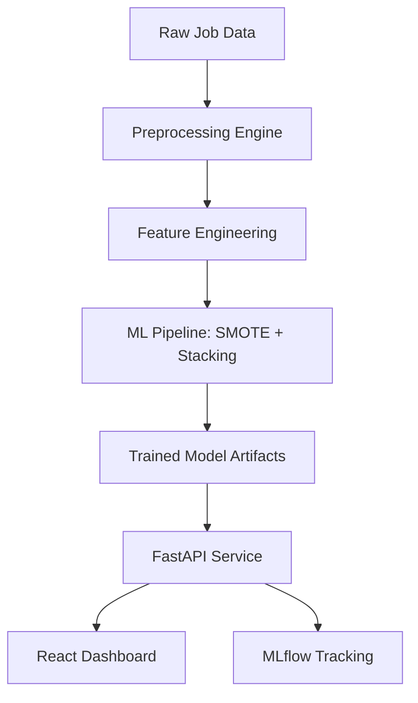

# SkillDemand AI 🚀

[](https://fastapi.tiangolo.com/)
[](https://react.dev/)
[](https://mlflow.org/)
[](https://scikit-learn.org/)

**SkillDemand AI** is a premium labor market intelligence system that predicts whether a job posting represents a **HIGH-DEMAND** skillset. Using advanced machine learning, it analyzes titles, technologies, seniority, and global market trends to provide instant demand insights.

## ✨ Key Features

- **🎯 Precision Prediction**: Predicts market demand (High vs. Standard) with optimized thresholds.
- **📊 Real-time Insights**: Dashboard tracking market distribution, role domain frequency, and model performance.
- **🤖 Intelligence Ensemble**: Stacking ensemble using Random Forest and XGBoost (SMOTE-balanced).
- **🎨 Elite UI**: Glassmorphic, dark-mode React interface with interactive Recharts visualizations.
- **🛡️ Secure API**: FastAPI backend with X-API-Key authentication and prediction history.
- **📈 MLOps Ready**: Full experiment tracking and metric logging with MLflow.

## 🏗️ Architecture



## 🚀 Quick Start

### 1. Backend Setup
```bash
# Install dependencies with uv
uv sync

# Run Preprocessing (Generates features)
python code/preprocessing.py

# Train Model (Logs to MLflow)
python code/modeling.py

# Start API
uvicorn code.app:app --reload
```

### 2. Frontend Setup
```bash
cd frontend
npm install
npm run dev
```

## 🧪 Testing

Run the comprehensive test suite to verify the API contract:
```bash
pytest tests/test_api.py
```

## 📊 Evaluation
The model optimizes for **F1-Score** on High Demand classes to ensure reliability for recruiters and job seekers. Performance metrics are automatically logged to `data/evaluation_metrics.json`.

---
*Developed for the Job Market Skill Demand Predictor Project.*
